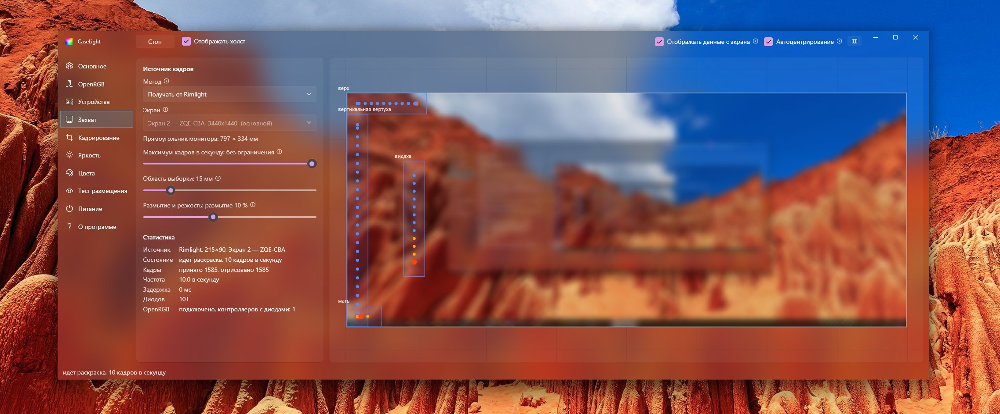
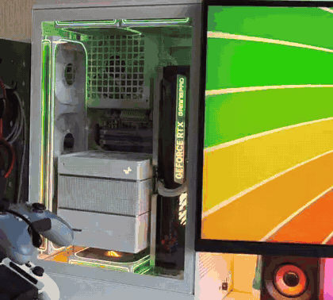

# CaseLight

*[Русский](README.md)*

Lighting inside a PC case reproduces the image on the screen. Devices are driven through
[OpenRGB](https://openrgb.org): the motherboard, strips and fans on its headers, the
graphics card, the memory modules.

Windows, x64, .NET 9.





## Placement model

The case stands next to the monitor, so the image can be continued past the edge of the
screen. The program holds a plan: a rectangle for the monitor and, around it in
millimetres, a rectangle for every lit device. Each LED takes its colour from the nearest
part of the screen. For a point outside the panel the coordinate is clamped to the edge, so
a fan to the right of the monitor reproduces its right edge at the fan's own height, and a
strip along the bottom of the case reproduces the bottom edge.

The plan is assembled with the mouse: dragging, resizing by a corner, rotation.

## Requirements

* Windows. The build targets SDK 10.0.22621, that is Windows 11 22H2; Windows 10 has not
  been tested.
* [.NET 9 Desktop Runtime](https://dotnet.microsoft.com/download/dotnet/9.0)
* OpenRGB with support for your devices.

Hardware compatibility is OpenRGB's responsibility. CaseLight works with whatever it
exposes over the SDK and is limited to its list of supported controllers.

The path to OpenRGB.exe is resolved automatically from `Program Files\OpenRGB`,
`%LocalAppData%\Programs\OpenRGB` and the uninstall entries in the registry; it is started
with `--server --startminimized`. The path can also be set by hand. If OpenRGB is already
running separately, its SDK server has to be enabled in its settings, otherwise port 6742
is closed.

## Installing

A built exe is available in [releases](https://github.com/Wa1den/CaseLight/releases).
Building from source:

```
dotnet publish src/CaseLight/CaseLight.csproj -c Release -r win-x64 --self-contained false -p:PublishSingleFile=true -o dist
```

## Setting up

1. Create a fixture for every lit device. A fixture specifies the controller, the zone and
   the range of LEDs within that zone.
2. Place the fixture on the plan according to the position of the device relative to the
   monitor. Monitor dimensions are entered for the visible part of the panel: about 597 by
   336 mm for a 27" 16:9 display.
3. Choose the arrangement: a strip, a closed contour (round or rectangular), or a point for
   a device that lights up as a whole.
4. For a closed contour, set the starting LED. The button next to it lights only the
   selected LED, which makes it possible to identify the bottom one visually.
5. For fans facing the viewer edge-on, tick "edge-on". The ring is then reduced to a
   vertical line.
6. Check the layout with the placement test: a patch is moved across the canvas in place of
   the screen frame.

For a check against a real frame, `pics/Rainbow.jpg` is an image with saturated colours in
every part of the frame. Set as the desktop background, it shows the whole layout at once:
every device should light up in the colour of the screen area next to it.

The number of LEDs on an ARGB header is not detected automatically, the header does not
report it, and OpenRGB substitutes a value of 60. Several fans may also be chained onto a
single header. The actual length is measured with `tools/RgbCalibrator`: the plus button
extends the lit run by one LED, and the value is taken from the point where the run stops
growing.

The sampling radius sets the size of the screen area averaged for one LED; the default is
60 mm. A smaller value makes the colour change noticeably on small movements in the frame,
a larger one averages it to a uniform shade.

## Frame source

The built-in capture runs DDA and WGC at the same time and takes the freshest frame; GDI is
enabled if both stop producing frames. The default rate is 30 frames per second.

The other option is receiving frames from [Rimlight](https://github.com/Wa1den/Rimlight),
the monitor bias lighting. The screen is then captured once for both programs. Frames are
passed through shared memory, and Rimlight has to be set to publish them. When Rimlight is
running anyway, this is the better option: two parallel captures of one screen share the
graphics card and both run slower.

Code shared by the two programs (capture, colour pipeline, zone sampling, frame bus, power
handling) is placed in `src/CaseLight.Core` as a separate copy. There is deliberately no
dependency on Rimlight: case lighting is meant to work on a machine with no monitor bias
lighting as well.

## Update rate

Every fixture has an update divider. It is needed because of the memory modules: they are
attached to the SMBus, writing to them is slow, and at the full rate they delay the other
devices. Updating them a few times a second is visually indistinguishable from the full
rate.

A device is always written in full, otherwise the part left unwritten would go dark. If
several fixtures with different dividers sit on one controller, the smallest divider
applies.

The same LEDs can belong to more than one fixture. Three fans wired in parallel appear in
OpenRGB as a single run of 32 LEDs while occupying three separate places on the plan. In
that case the colours are averaged.

## Privileges

Administrator rights are needed only for the memory modules, since access to the SMBus is
closed without them. The motherboard, fans and graphics card are available from an ordinary
session, and no UAC prompt appears at login.

## Power

The lighting is blanked on exit, on session lock, on suspend and when the display is turned
off. Each of the four cases is configured separately.

After a wake, writing to the devices is postponed. The controllers are re-enumerated on the
USB bus, OpenRGB keeps writing to the previous descriptors and returns success, and the
lighting stays in the state it was put into when power was applied. By default the server
is restarted and the first write happens 8 seconds later. Both values are configurable; a
device rescan is available instead of a restart, but OpenRGB sometimes crashes during it.

## Files

The layout, the settings and the log are kept in `%AppData%\CaseLight\`. The entire state
of the program is stored in `scene.json`, and moving it to another machine is a matter of
exporting and importing that file.

## Localisation

Two languages are built into the program, Russian and English. On the first run they are
written to `%AppData%\CaseLight\lang\` as `ru.json` and `en.json`, and from then on those
files are what gets read: an edit in a file shows up after a restart. When the program is
updated both built-in files are rewritten so that an old file cannot hide new wording; the
`_version` field is what marks that. Added languages are left alone.

A translation of your own is one more file in the same folder:

1. Copy `en.json` under a name that is the language code, `de.json` for instance: the file
   name is the code. Templates of both built-in languages are in the [lang](lang) folder of
   the repository.
2. Replace the values with the translated ones and leave the keys on the left as they are.
   `{0}` inside a string is a substitution (screen size, LED count, controller name) and has
   to be kept. The `_name` field holds the name of the language as it should appear in the
   list, `Deutsch` for instance. The `_version` field can be deleted: it only concerns the
   built-in files.
3. Start the program — the language appears in the list in the General section.

The file is only checked for its basic shape: it has to read as JSON of «string: string»
and to carry at least a few known keys, otherwise it is not taken for a translation and is
skipped with a line in the log. Translating everything at once is not required: the keys
that are missing come from English. For an added language part of the service text stays in
English as well — log messages and status lines are set in code rather than in JSON.

## Tools

The `tools` directory is not part of the solution and is built separately. These utilities
were used to find out which control paths were available.

* `RgbProbe` prints what the SDK server reports: devices, zones, modes, LED counts.
* `RgbCalibrator` measures the length of a strip on a header.
* `LampProbe` lists the devices available through the HID LampArray in Windows itself,
  without OpenRGB.

## Licence

[MIT](LICENSE).
